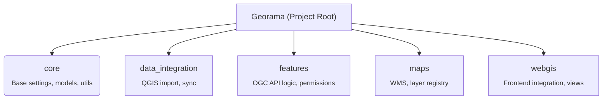

---
tags:
  - Development
  - API Reference
  - Overview
---


# 📘 API Reference Overview

## 🧭 Georama Module Structure




## 🧩 Core Module
In the core module, we define the base settings, models, and utils. We also have some custom permissions handling. 
Functions and templates which are used in the other modules are also defined in the core module.

```shell
core/
├── auth (basic auth)
├── entities (basic permission handling of the different ressources)
└── templates (custom templates)
```

[Core API Reference](core.md).


## 🔄 Data Integration Module
Integrates geodata from QGIS Projects. Here we have the definitions of the Mandant, Project and the different Datasets, 
which are used to read in the QGIS Projects.

```shell
data_integration/
├── migrations
└── templates
```

[Data Integration API Reference](data_integration.md).


## 🌐 Features Module
Extracts vector features with pygeoapi power and serves them as OGC API Features.


```shell
features/
├── migrations
├── pygeoapi_providers
├── static
└── templates
```

[Features API Reference](features.md).


## 🗺️ Maps Module
Draws Maps with QGIS power via [QGIS-Server-Light](https://github.com/opengisch/qgis-server-light) and serves them as WMS.

```shell
maps/
├── interfaces
├── migrations
├── services
├── static
└── templates
```

[Maps API Reference](maps.md).


## 🌍 WebGIS Module (Under development)
Will later serve geo data with [geogirafe](https://gitlab.com/geogirafe/gg-viewer) as frontend. 

```shell
webgis/
├── interfaces
├── management
├── migrations
├── static
└── templates
```

[WebGIS API Reference](webgis.md).