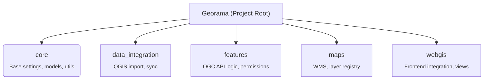

# 📘 API Reference Overview

## Georama Overview

```mermaid
graph TD;
  georama["Georama (Project Root)"]

  georama --> core("core<br><sub>Base settings, models, utils</sub>")
  georama --> data_integration["data_integration<br><sub>QGIS import, sync</sub>"]
  georama --> features["features<br><sub>OGC API logic, permissions</sub>"]
  georama --> maps["maps<br><sub>WMS, layer registry</sub>"]
  georama --> webgis["webgis<br><sub>Frontend integration, views</sub>"]
```

