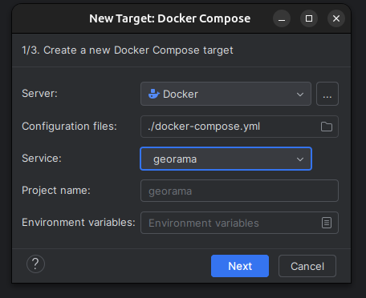
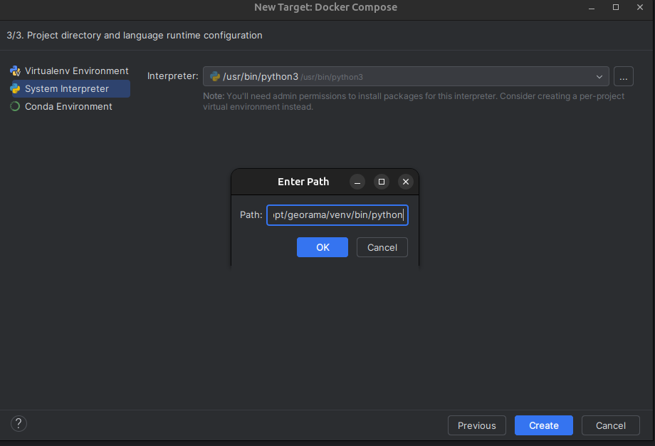
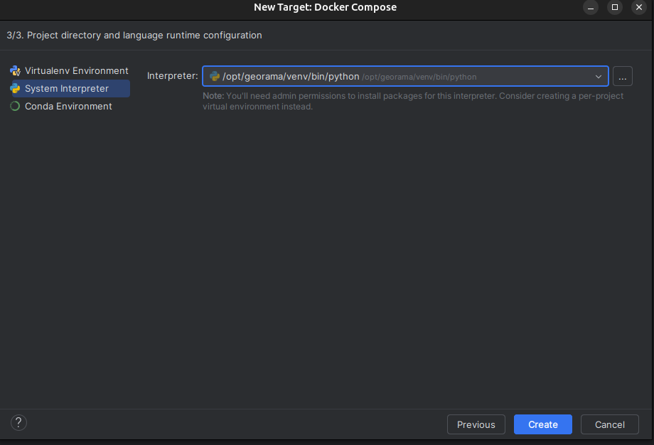
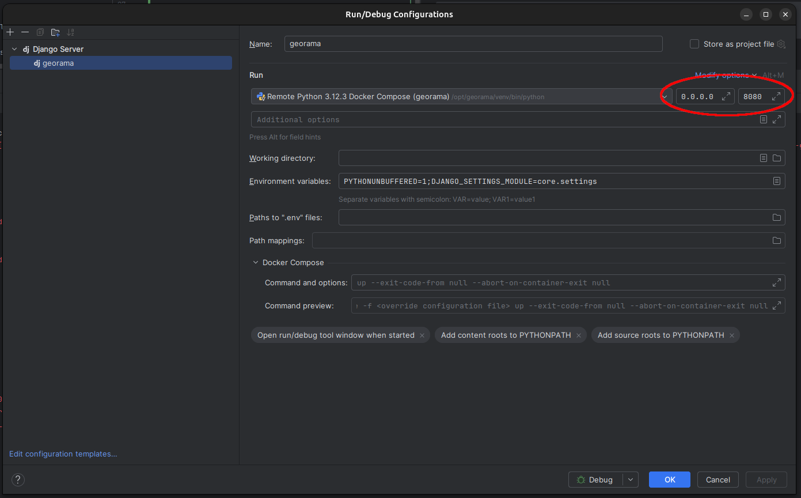

---
tags:
  - Setup
  - Development
---

## Setup the environment variables
Please read the following instructions:  [setup_env.md](../setup_env.md)

## Development in a Container

Follow the
<a href="https://github.com/opengisch/georama?tab=readme-ov-file#quickstart" target="_blank">
Quickstart in README.md</a>. Check if everything is running.

### 🔄 Live Code Reloading

The Docker setup mounts the local project code into the container (specifically the `georama` service). This enables **hot reloading**, meaning code changes are picked up without restarting the container.

### 🧠 IDE Integration (Container Interpreter)

If you use an IDE (e.g. PyCharm), you can point it to the Python interpreter inside the container: `/opt/georama/venv` This gives you full code intelligence and completion based on the container’s environment.

---

## 🧑‍💻 Using PyCharm with Docker Interpreter

### 🐳 Adjust the Dockerfile
Add comment marks to the line 48+49+50 in the `Dockerfile` as shown below:
```shell
#ENTRYPOINT ["/tini", "--", "make"]
#
#CMD ["serve-dev"]
```

Now run:
```shell
docker compose build
docker compose up -d
```

### ⚙️ Configure the Python Interpreter in PyCharm


Specify the interpreter path as: `/opt/georama/venv/bin/python`






### 🐞 Configure Run/Debug
Adjust the IP in the run/debug configuration to `0.0.0.0` and the port to `4242`



### ▶️ Start Debugging
Finally you can now connect to the pycharm debugger


