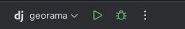
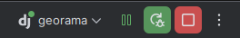

---
tags:
  - Setup
  - Development
---

# 🛠️ Development Guide

This page outlines how to develop and run **Georama** either inside a Docker container or directly on your local machine.

---

## Setup the environment variables
Please read the following instructions:  [setup_env.md](setup_env.md)

---

## 🐳 Development in a Container

Follow the
<a href="https://github.com/opengisch/georama?tab=readme-ov-file#quickstart" target="_blank">
Quickstart in README.md</a>. Check if everything is running.

### 🔄 Live Code Reloading

The Docker setup mounts the local project code into the container (specifically the `georama` service). This enables **hot reloading**, meaning code changes are picked up without restarting the container.

### 🧠 IDE Integration (Container Interpreter)

If you use an IDE (e.g. PyCharm), you can point it to the Python interpreter inside the container: `/opt/georama/venv` This gives you full code intelligence and completion based on the container’s environment.

---

## 💻 Development on the Host (Local Machine)

!!! info
    Local development requires **Python 3.10 or lower** due to package compatibility.

### 📦 Dependencies

Make sure these are available on your system:

- GDAL (incl headers have to be available)
- `make`
- general `pip` and `virtualenv` has to be available

#### ✅ Install on Ubuntu:

```bash
sudo apt-get update && sudo apt-get install gdal make
```

### 🧪 Set Up Virtual Environment

To prepare a local virtual environment (in the folder `.venv`) run the following command:

```shell
make install-dev
```

In case you are using an IDE you can point it to that venv to have code completion and code inspection.

### ✅  Running the test

To run the tests locally execute the following command:

```shell
make tests
```

### 🌍 Running the test server

Georama needs a postgres database to store its stuff in. Unless you have a running database already somewhere
you can easily start one via docker.

1. Spin up a database (for georama admin configuration):
```shell
docker run --rm -d --name georama -e POSTGRES_PASSWORD=test -p 54321:5432 postgis/postgis:latest
```

The maps ([qgis-server-light](https://github.com/opengisch/qgis-server-light)) part of georama needs a redis
instance to put jobs in.

2. Start a redis instance (for qsl integration):
```shell
docker run --rm -d -p 1234:6379 --name georama-redis redis
```

3. Launch the Auto-Reloading Dev Server:
You can spin up a self reloading DEV server which detects code changes automatically with:

```shell
make serve-dev
```

4. Initialize the Database:
Once the server is running, open another terminal to create the database structure for Georama.

```shell
make migrate
```

5. Create a Superuser:
Create a superuser which can be used to log into Georama:

```shell
make create-superuser
```

6. Create example content::
Create example content (like demo users):

```shell
make create-example-content
```

## 🔃🛠️ Update QGIS Server light lib

[qgis-server-light](https://github.com/opengisch/qgis-server-light) interface is part of georama.

It is currently installed directly from github. You may want to use an updated version in your setup
while coding.

To force reinstall GitHub dep qgis_server_light **docker compose**:
```shell
docker compose exec georama bash -c '/opt/georama/venv/bin/pip install --force-reinstall --no-deps "git+ssh://git@github.com/opengisch/qgis-server-light.git@master#qgis_server_light"'
```

To force reinstall GitHub dep qgis_server_light **locally**:
```shell
.venv/bin/pip install --force-reinstall --no-deps "git+ssh://git@github.com/opengisch/qgis-server-light.git@master#qgis_server_light"
```


## 🧑‍💻 Using PyCharm with Docker Interpreter

### 🐳 Adjust the Dockerfile
Add comment marks to the line 48+49+50 in the `Dockerfile` as shown below:
```shell
#ENTRYPOINT ["/tini", "--", "make"]
#
#CMD ["serve-dev"]
```

Now run:
```shell
docker compose build
docker compose up -d
```

### ⚙️ Configure the Python Interpreter in PyCharm


Specify the interpreter path as: `/opt/georama/venv/bin/python`


### 🐞 Configure Run/Debug
Adjust the IP in the run/debug configuration to `0.0.0.0` and the port to `4242`


### ▶️ Start Debugging
Finally you can now connect to the pycharm debugger






## ✅ Next Steps
See the [Workflow](workflow.md)
