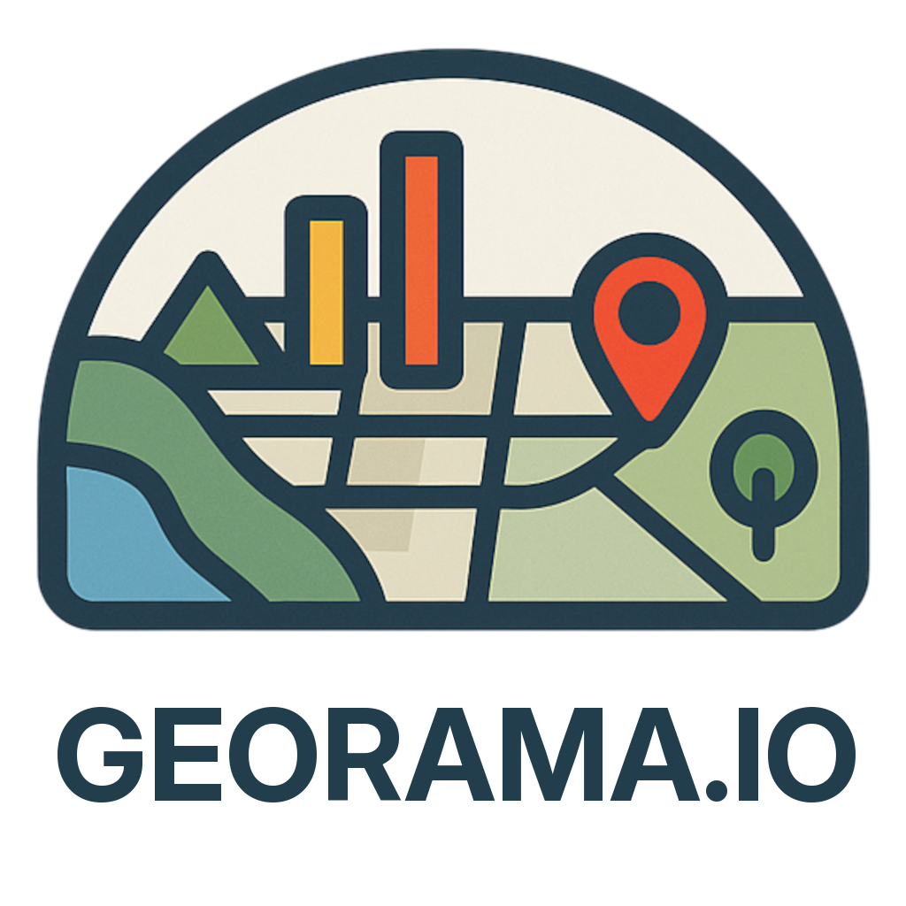

# Welcome to the Georama Documentation

**Georama** is a modular suite of Django apps designed to help you organize, manage, and publish geospatial data directly from your QGIS projects.

Built for flexibility and integration, Georama streamlines the process of serving geodata through modern web standards while giving you full control over metadata and permissions.

---

## 🚀 Core Features

- **Seamless QGIS Project Import**  
  Import and manage QGIS projects directly into your Django-based environment.

- **WMS Publishing with [qgis-server-light](https://github.com/opengisch/qgis-server-light)**  
  Serve your layers as OGC-compliant **WMS 1.3.0** services using a lightweight QGIS server.

- **WFS 3 Publishing via `pygeoapi`**  
  Share your data using the modern **OGC API - Features** (WFS 3) standard, backed by  [pygeoapi](https://github.com/geopython/pygeoapi).

- **Metadata Management**  
  Maintain flexible and extensible metadata for your layers, datasets, and services.

- **Fine-Grained Permission Control**  
  Control access to layers, attributes, and metadata with a customizable permission system.

- **Identity Provider Integration**  
  Leverage third-party Django apps to integrate with external authentication providers (e.g., OAuth, SAML, LDAP).

---

## 🧭 Get Started

Ready to dive in? Start with the following resources:

- [Quickstart Tutorial](quick_start.md)
- [API Reference](api_references/overview.md)
- [Endpoints](endpoints.md)

---

## 🛠 Built for Extensibility

Whether you're building a custom geodata platform or integrating with existing infrastructure, Georama provides the flexibility you need—thanks to its modular Django architecture and compatibility with QGIS.

---

**Georama** is your bridge between powerful desktop GIS and scalable, standards-based web publishing.

