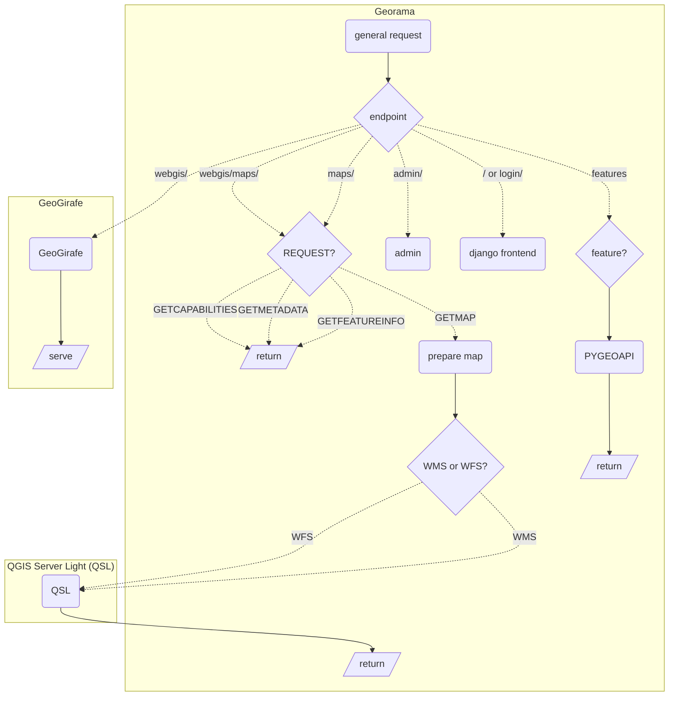

---
tags:
  - Process
  - Development
---

```mermaid
flowchart TD;
  subgraph Georama
      request("general request") --> id1{"endpoint"}
      id1  -."webgis/maps/".-> maps1
      id1  -."admin/".-> admin("admin")
      id1  -."/ or login/".-> root("django frontend")
      id1  -."maps/".-> maps1{"REQUEST?"}

      maps1 -."GETCAPABILITIES".-> maps2[/return/]
      maps1 -."GETMETADATA".-> maps2[/return/]
      maps1 -."GETFEATUREINFO".-> maps2[/return/]
      maps1 -."GETMAP".-> maps3("prepare map")
      maps3 --> maps4{"WMS or WFS?"}

      pygeo --> pygeo2[/return/]
      id1  -."features".-> features1{"feature?"}
      features1 --> pygeo("PYGEOAPI")

      mapReturn[/return/]
  end

  subgraph "QGIS Server Light (QSL)"
      maps4 -."WFS".-> qsl("QSL")
      maps4 -."WMS".-> qsl("QSL")
      qsl --> mapReturn
  end

  subgraph "GeoGirafe"
      id1  -."webgis/".-> gg("GeoGirafe")
      gg --> gg2[/serve/]
  end
```
