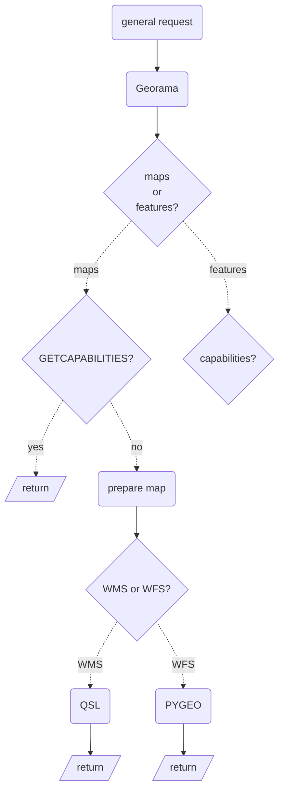

---
tags:
  - Process
  - Development
---

```mermaid
flowchart TD;
  request("general request") --> georama("Georama")
  georama --> id1{"maps \nor \nfeatures?"}
  id1  -."maps".-> maps1{"GETCAPABILITIES?"}
  maps1 -."yes".-> maps2[/return/]
  maps1 -."no".-> maps3("prepare map") 
  maps3 --> maps4{"WMS or WFS?"}
  maps4 -."WMS".-> qsl("QSL")
  qsl --> qsl2[/return/]
  maps4 -."WFS".-> pygeo("PYGEO")
  pygeo --> pygeo2[/return/]
  id1  -."features".-> features1{"capabilities?"}
```