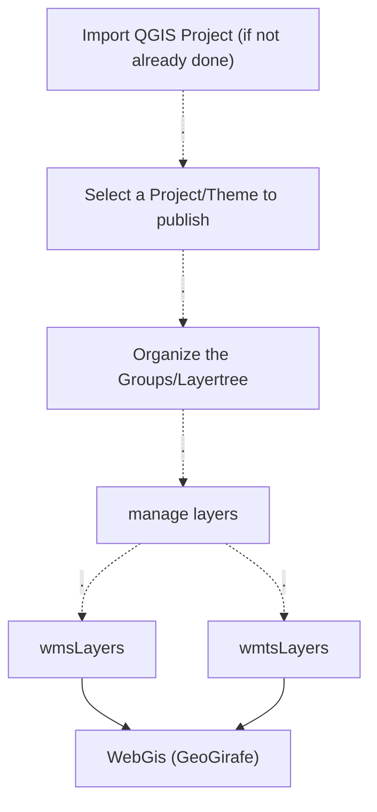

# Publishing a Project/Theme to a WebGIS (GeoGirafe)

## Relevant Navigation Menu Entries
The relevant Navigation Menu entries can be found in Django Admin at the bottom:

## Webgis Workflow

## Data integration -> Project
If you not already have imported a QGIS Project, now is the time to do so. Go to `Data integration -> Project` and press
the button `Qgis Projects`

Choose which project you want to integrate and press the button `integrate` beside the project.

Now you are ready to move to the next step.

## Themes
Press the button `Publish from Project`

Now  you can select a QGIS Project

The OGC Server of the project is automatically added.

## Groups (Layertree)
Here you can reorder the groups/layertree for publishing the `themes.json`

## OGC Servers
The OGC Server of the project is automatically added.

## WMS Layers
!!! info
    Currently all layers have to be to set to public to be visible in the WebGIS

Here you can manage the single wms layers.

## WMTS Layers
!!! info
    Currently all layers have to be to set to public to be visible in the WebGIS

Here you can manage the single wmts layers.

## GeoGirafe

Now you can navigate to your GeoGirafe instance to view your theme, which is in dev mode found under [http://localhost:9309](http://localhost:9309)