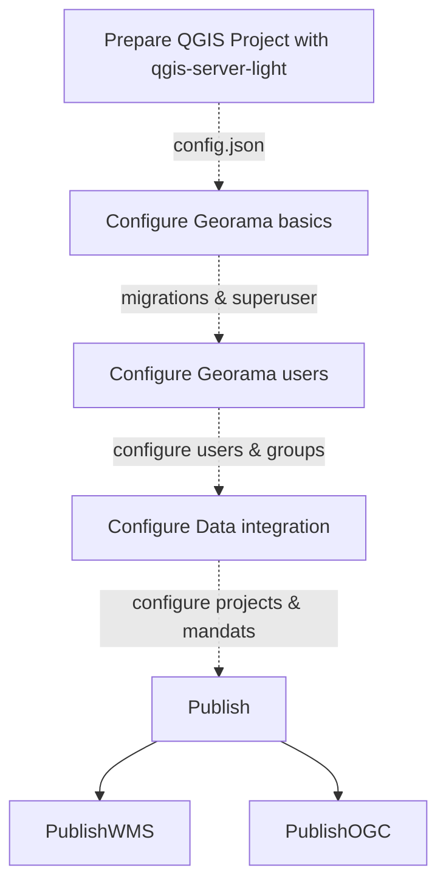

---
tags:
  - Setup
  - Workflow
---

# ⚙️ Georama Workflow Guide

This guide walks you through the full Georama publishing workflow — from preparing your QGIS project, configuring Georama, and integrating services, to publishing WMS and OGC API (WFS 3) layers.

---

## 🗺️ Overview


## 📁 QGIS Project Structure
Your QGIS projects have to be structured as follows and should be referenced in the `.env` file:
```
data/
├── projects
│   ├── data
│   ├── project_one.json (generated by the CLI script)
│   ├── project_one.qgz
│   ├── project_one.xml
│   ├── project_two.json (generated by the CLI script)
│   ├── project_two.qgz
│   ├── project_two.xml
│   ├── print_templates
│   └── styles
└── forest_fires
    ├── data
    ├── forest_fires.json (generated by the CLI script)
    ├── forest_fires.qgz
    ├── forest_fires.xml
    ├── print_templates
    └── styles
```


## 🧰 Prepare the QGIS Projects

### Prepare the QGIS Project
#### Datasources
Datasources f.e. *.gpkg files and database connections must be integrated in the project and working. Files like *.gpkg must be inside the project folder in a way that QSL has access to it.

#### Layers

For each group, do the following task:

Right click on the layer, select the menu point `Properties` now choose the menu point `QGIS Server`, enter a short name and a title.


#### Groups 

For each group, do the following task:

Right click on the group, select the menu point `Set Group WMS Data`, now enter a short name and a title.


### QGIS Server Light (QSL)
QGIS Server Light (QSL) offers a CLI script to extract the config JSON from QGIS Projects. It is available in the DEV version of the QSL docker image from
the github container registry.

### 🔧 CLI Help
You can use that as follows:

```shell
docker run --rm ghcr.io/opengisch/qgis-server-light-dev:latest qgis_server_light.exporter.cli --help
```

The CLI script opens the stated QGIS project and uses pyqgis to extract the elements which are necessary to build the JSON. Therefore the data which is in the
defined QGIS project has to be available (local files, databases etc.). In most cases the process will run without complaints, But if the data is not available
for instance the bounding boxes cant be calculated and are default values which are not the right ones.

!!! info
    QGIS project has to be available (local files, databases etc.)

Since the data is touched the process lasts a bit depending on the amount of layers you have in your project.

!!! info
    Remark: Having spaces in the project file name is possible but not a good idea in general.

The JSON is written to stdout. To put it in a file the stdout has to be piped into an file.

### 🚀 Generate JSON
To generate

```shell
# update the container
docker pull ghcr.io/opengisch/qgis-server-light-dev:latest
# generate the JSON for Forest Fires project
docker run --rm -v $(pwd)/data:/io/data ghcr.io/opengisch/qgis-server-light-dev:latest qgis_server_light.exporter.cli --unify_layer_names_by_group True --project /io/data/forest_fires/forest_fires.qgz > data/forest_fires/forest_fires.json
```
!!! info
    The JSON can be used to configure Georama and must be available in the QGIS directory you specified in the `.env` file.

## 🛠️ Configure Georama Basics
Now you can configure the Georama basics in the admin interface.

Add users and groups to configure fine grained access control later on.

## 🧩 Configure a Project
Import a QGIS project from the generated JSON file.


Configure the project details.


## 🌍 Publish a OGC Feature


## 🖼️ Publish a WMS layer


## 🔗 Accesing the published data
See [Endpoints](endpoints.md) to access the published data.
