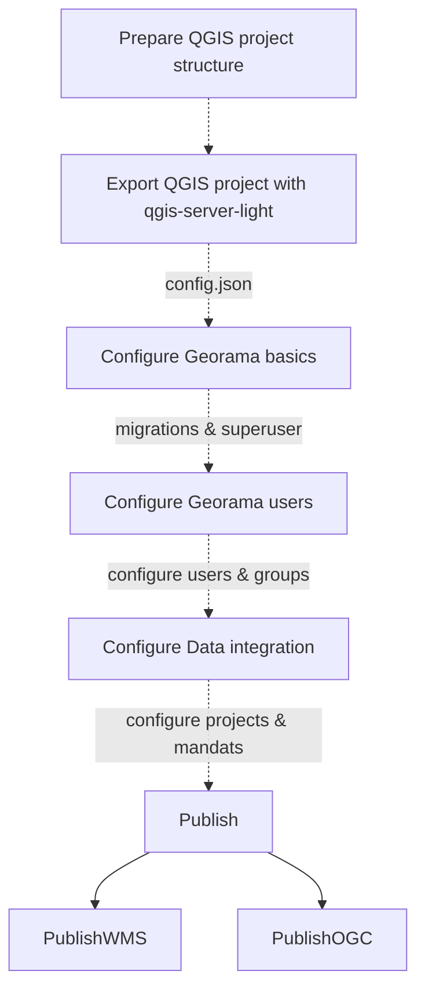

---
tags:
  - Setup
  - Workflow
---

# ⚙️ Georama Workflow Guide

This guide walks you through the full Georama publishing workflow — from preparing your QGIS project, configuring Georama, and integrating services, to publishing WMS and OGC API (WFS 3) layers.

!!! important
    We proceed with a complete new stack of services. In case you arrived here from the DEV setup,
    please stop and or remove all running services first before you proceed.

We will use the docker approach to set up Georama for this guide.

---

## 🗺️ Overview


## 📁 QGIS Project Structure
Your QGIS projects have to be structured as follows:
```
data/
├── thematic_group
│   ├── data
│   ├── project_one.json (generated by the CLI script)
│   ├── project_one.qgz
│   ├── project_one.xml
│   ├── project_two.json (generated by the CLI script)
│   ├── project_two.qgz
│   ├── project_two.xml
│   ├── print_templates
│   └── styles
└── forest_fires
    ├── data
    ├── forest_fires.json (generated by the CLI script)
    ├── forest_fires.qgz
    ├── forest_fires.xml
    ├── print_templates
    └── styles
```

The root folder of this example is called `data`. This is not mandatory and you can have whatever name you
want. It serves as an example in this case. You can further:

- put arbitrary amount of direct subfolders but minimal one in `data`, these folders are mainly meant to give
  organizational to group projects into maybe thematic subdivisions.
- Each of this sub folders can host an arbitrary amount of QGIS Projects but at least one and related data.

!!! important
    Folder and file names may contain spaces. However, this is not good practise and you should avoid
    using them.

!!! hint
    The data should be kept in a subfolder relatively to the corresponding project. We do not give any
    mandatory structure here. The only important constraint is to **keep local data references in the QGIS project relative**

!!! success
    Once you have aligned your QGIS project file structure to the tree above, you can proceed with the next step.

## 🧰 Prepare the QGIS Projects

Now you can open each QGIS project and style, add data as you wish.

### Prepare the QGIS Project

#### Datasources

Datasources f.e. *.gpkg files and database connections must be integrated in the project and working. Files like *.gpkg must be inside the project folder in a way that QSL has access to it.

#### Layers

For each layer in your project, do the following task:

Right-click on the layer, select the menu point `Properties` now choose the menu point `QGIS Server`, enter a short name and a title.


#### Groups

For each group, do the following task:

Right click on the group, select the menu point `Set Group WMS Data`, now enter a short name and a title.


### QGIS Server Light (QSL)

QGIS Server Light (QSL) offers a CLI script to extract the config JSON from QGIS Projects. It is available in
the DEV version of the QSL docker image.

### 🔧 CLI Help
You can use that as follows:

```shell

QGIS_PROJECT_FOLDER="/absolute/path/to/QGIS/project/folder" # without trailing /
QGIS_PROJECT_FILENAME="my_project" # QGIS project filename, without extension nor trailing dot
QGIS_PROJECT_EXTENSION="qgz" # qgs or qgz

docker run --rm -v "${QGIS_PROJECT_FOLDER}":/project  --entrypoint /opt/qgis-server-light/venv/bin/python opengisch/qgis-server-light-dev:latest -m qgis_server_light.exporter.cli --unify_layer_names_by_group True --project "/project/${QGIS_PROJECT_FILENAME}.${QGIS_PROJECT_EXTENSION}" > "${QGIS_PROJECT_FOLDER}/${QGIS_PROJECT_FILENAME}.json"
```

The CLI script opens the stated QGIS project and uses pyqgis to extract the elements which are necessary to
build the JSON. Therefore, the data which is in the defined QGIS project has to be available (local files,
databases etc.). In most cases the process will run without complaints, But if the data is not available  for
instance the bounding boxes cant be calculated and are default values which are not the right ones.

!!! info
    QGIS project has to be available (local files, databases etc.)

Since the data is touched the process lasts a bit depending on the amount of layers you have in your project.

!!! info
    Remark: Having spaces in the project file name is possible but not a good idea in general.

The JSON is written to stdout. To put it in a file the stdout has to be piped into a file.

### 🚀 Generate JSON

This guide assumes you started a shell session inside the root of your project structure. So all paths
in the following instructions are adapted to that. In our example we would have changed directory into `data`.

```shell
# generate the JSON for Forest Fires project
docker run --rm -v $(pwd):/io/data --entrypoint /opt/qgis-server-light/venv/bin/python3 opengisch/qgis-server-light-dev:latest -m qgis_server_light.exporter.cli --unify_layer_names_by_group True --project /io/data/forest_fires/forest_fires.qgz > forest_fires/forest_fires.json
```

!!! info
    Be sure to use a recent version of QGIS-Server-Light exporter:
    ```shell
    # update the container
    docker pull opengisch/qgis-server-light-dev:latest
    ```

You have to execute this command for every QGIS project in your structure and everytime you applied a change
to the QGIS project.

!!! info
    The JSON can be used to configure Georama.

## 🚀 Start the Georama services

```shell
docker run --rm -d --name georama-db -e POSTGRES_PASSWORD=test -p 54321:5432 postgis/postgis:latest
docker run --rm -d -p 1234:6379 --name qsl-redis redis
# it is correct that we use a different image for the qsl worker here
docker run -d --rm --net host --name qsl -v $(pwd):/io/data opengisch/qgis-server-light:latest
# this assumes you have built the Georama image locally before
docker run -d -p 4242 --rm --net host --name georama -v $(pwd):/io/data georama:dev
docker exec georama make migrate
docker exec -ti georama make create-superuser
```

!!! info
    In case of questions consult the [Dev guide for the docker approach](dev/docker.md)

!!! success
    Admin interface (user: admin password: whatever-you-chose): http://localhost:4242/admin/

## 🛠️ Configure Georama Basics

Now you can configure the Georama basics in the admin interface.

Add users and groups to configure fine-grained access control later on.

## 🧩 Configure a Project
Import a QGIS project from the generated JSON file.


## 🌍 Publish a OGC Feature


## 🖼️ Publish a WMS layer


## 🔗 Accesing the published data
See [Endpoints](endpoints.md) to access the published data.
