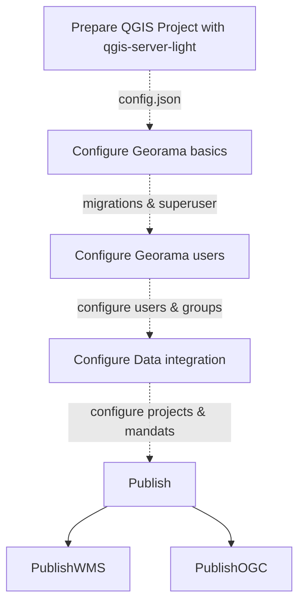
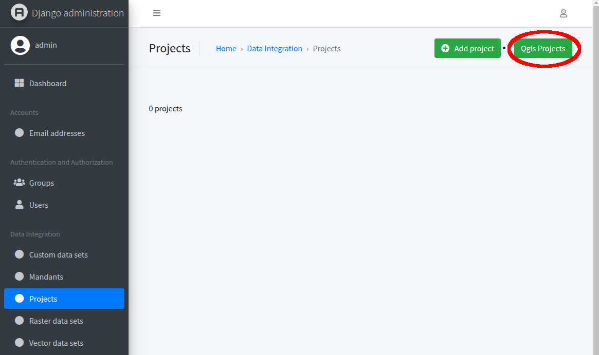
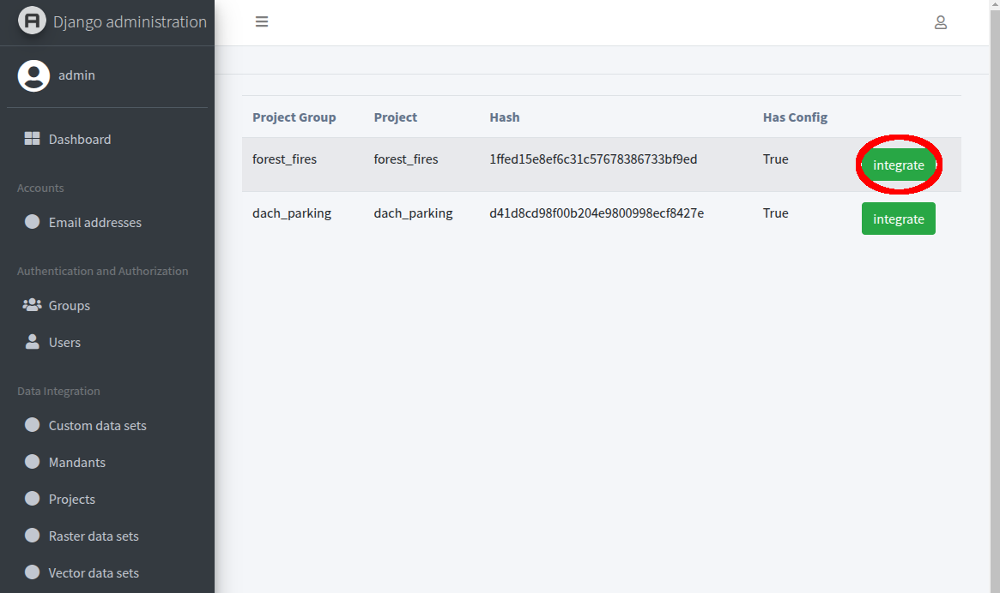

## Prepare the QGIS Projects

QGIS Server Light (QSL) offers a CLI script to extract the config JSON from QGIS Projects. It is available in the DEV version of the QSL docker image from
the github container registry.

You can use that as follows:

```shell
docker run --rm ghcr.io/opengisch/qgis-server-light-dev:latest qgis_server_light.exporter.cli --help
```

The CLI script opens the stated QGIS project and uses pyqgis to extract the elements which are necessary to build the JSON. Therefore the data which is in the
defined QGIS project has to be available (local files, databases etc.). In most cases the process will run without complaints, But if the data is not available
for instance the bounding boxes cant be calculated and are default values which are not the right ones.

Since the data is touched the process lasts a bit depending on the amount of layers you have in your project.

Remark: Having spaces in the project file name is possible but not a good idea in general.

The JSON is written to stdout. To put it in a file the stdout has to be piped into an file.

To generate 

```shell
# generate the JSON for Forest Fires project
docker run --rm -v $(pwd)/data:/io/data ghcr.io/opengisch/qgis-server-light-dev:latest qgis_server_light.exporter.cli --unify_layer_names_by_group True --project /io/data/forest_fires/forest_fires.qgz > data/forest_fires/forest_fires.json
```

- admin interface: http://localhost:8080/admin/
- login page for a user: http://localhost:8080/login
- WMS Capabilities: http://localhost:8080/maps?service=WMS&request=GETcapabilities&version=1.3.0
- Endpoint to use WMS in e.g. QGIS Desktop for tests: http://localhost:8080/maps
- Endpoint to use WFS in e.g. QGIS Desktop for tests: http://localhost:8080/features

## Configure Project



